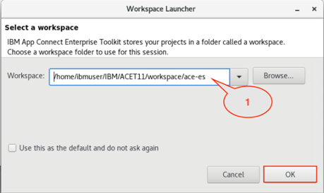
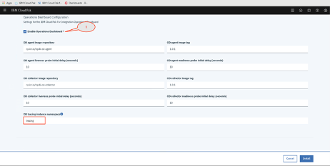

**Augment existing business functions with new applications using
Kafka**

The most interesting and impactful new applications in an enterprise are
those that provide interactive experiences by reacting to existing
systems carrying out a business function. In this tutorial, we take a
look at an example from the retail industry starting with an existing
API orchestrating the business function to \"place an order\". Let's say
we have an existing API orchestrating the business function to \"place
an order\", and when a customer places an order, we want to provide a
real-time response - for example, reward the customer with points in the
customer loyalty app or sign them up for an email nurture program or
gamification experience. To do any of those actions, we need each order
to emit an event. IBM Cloud Pak for Integration combines integration
capabilities with Kafka-based IBM Event Streams to make the data
available to cloud-native applications that can subscribe to the data
and use it for a variety of business purposes

In this tutorial, you create a topic in IBM Event Streams, modify an
integration flow to call an API, produce an event to a topic, and use a
tracing tool to verify the message from App Connect Enterprise to Event
Streams.

In this tutorial, you will explore the following key capabilities:

-   Prepare the IBM Cloud Pak for Integration environment

-   Create and configure an Event Streams topic

-   Configure App Connect Enterprise message flow using App Connect
    Enterprise toolkit

-   Configure App Connect Enterprise service

-   Deploy App Connect BAR file on App Connect Enterprise Server

-   Test App Connect Enterprise API sending a message to Event Streams

-   Check the message using Operations Dashboard (tracing).

Task 1 - Preparing IBM Cloud Pak for Integration Environment

The demo runs on a virtual machine that is provided by IBM Demos. To get
access, reserve an instance in the **Before you start **section on this
tutorial page. You then receive an email with the URL and password to
access the virtual machine.

Navigate to the URL in the email, which opens the IBM Demonstration
Portal. Enter the password also included in the email. The IBM
Demonstration Portal presents several Linux virtual machines configured
in an IBM Cloud Pak for Integration cluster on Red Hat OpenShift.

1.  If the environment is already up and running when you open your
    reservation, skip to step 3. If it is not running, continue to step
    2.\
    

2.  Once the virtual machines have started, start IBM Cloud Pack. Click
    the **Developer **Machine screen image to start your lab exercise.\
    

3.  To access the Developer machine, log in:  userid: **ibmuser **and
    password: **passw0rd .**

4.  Open a browser and click IBM Cloud Pak for Integration Bookmark
    bar.\
    

5.  **Log in to IBM Cloud Pak for Integration. **The username and
    password are already filled in. If not, ensure
    username: **admin **and password: **passw0rd** is entered.
    Click **Log in **and then click **Skip Welcome.**\
    

 

Task 2 -- Creating and configuring an Event Streams Topic

Creating an Event Streams topic in the existing Event Streams instance.

1.  On the **IBM Cloud Pak for Integration **main page, click **View
    Instances. The list of i**ntegration products installed is displayed
    (API Connect, App Connect, Asset Repository, DataPower,  Event
    Streams, MQ, and Tracing).\
    

2.  Click **es-2 **to use the existing Event Streams instance.

3.  On the IBM Event Streams main page, check the status of the
    instance **(System is healthy).**

4.  Click ** Create a topic **to  configure a topic.\
    

5.  View the full range of configuration options by setting the **Show
    all available options **to **on**.\
    Create the topic as follows:

    1.  **Topic name**: ***customerinfo***

    2.  **Partitions**: ***1 ***(A partition is an ordered list of
        messages)

    3.  **Replicas**: ***3 ***(In order to improve availability, each
        topic can be replicated onto multiple brokers)

    4.  **Minimum in-sync replicas**: ***2 ***(Determines the
        reliability guarantee achievable for this topic)

    5.  Set **Retention time: *****10 Minutes **(*This is how long
        messages are retained before they are deleted)

    6.  Click **Create topic.**\
        \
        The Topics page is displayed**. **Your new topic is displayed
        along with a completion notification.

6.  To connect to this cluster, you will need an **API key** that allows
    access to the topic, the **Bootstrap server** address to connect to
    the cluster, and the **PEM certificate** for securing the connection
    from your client to your cluster.

    1.  Click **Generate API Key** to create an API key.

2.  Enter the name of your application (use ***customerinfo***),
    select **Produce only**, and click **Next**.

3.  Enter the name of the topic **customerinfo**, and click **Generate
    API key**. Event Streams generates the API key.

4.  Click **Download as JSON** and click **Copy API key to **copy key to
    the clipboard. Click **Close**.

5.  In the Cluster connection page. Copy **Bootstrap server** address
    and download the **PEM certificate** (the es-api-key is located in
    the /home/ibmuser/Downloads directory).\
    

Task 3 - Configuring App Connect Enterprise flow using App Connect
Enterprise Toolkit

You have created a topic in Event Streams created. App Connect
Enterprise produces a message and send it to the Event Streams topic. In
this task, you will configure an App Connect Enterprise message flow and
generate a BAR file to deploy in the App Connect Enterprise Dashboard.

1.  You have configured Event Streams configured. Open a terminal window
    (Developer Machine). Enter **ace toolkit .**\
    

2.  Check the App Connect Enterprise workspace directory routes to the
    ace-es folder (/home/ibmuser/IBM/ACET11/workspace/ace-es).
    Click **OK** to open App Connect Enterprise toolkit.\
    

3.  Under Application Developer on the left bar, select **customerinfo
    \--\> Resources \--\> Subflows **and click **getid.subflow. **Some
    errors might show up, you will fix this after you complete and save
    message flow.

    1.  Select **customerinfo** node (Kafka Producer** **node)

    2.  Click **Properties.**

    3.  Select **Basic ** properties

    4.  Check topic name: **customerinfo **(the topic name that you
        created in Event Streams).

    5.  Paste the Bootstrap servers address (the address is found in
        Event Streams, under C**onnect to this cluster-\>Cluster
        connection**)

4.  In the Security Tab, set the Security Protocol to **SASL SSL **and
    SSL protocol to **TLSv1.2 .**\
    

5.  Save the message flow, click the **Save **button**.**\
    

6.  You need to deploy the customerinfo application in App Connect
    Enterprise server. Select **the customerinfo application**.
    Click ** New \--\> BAR file**.\
    

7.  Enter the suggested BAR file  name: **customerinfo **and
    click **Finish.**\
    

8.  Check **customerinfo **application box on the REST API tree. If
    necessary scroll right to check **Compile and in-line resource **and
    Click **Build and Save**.\
    

9.  A pop-up window display the message "Operation completed
    successfully." Click **Ok **to confirm and close the App Connect
    Enterprise

Task 4 - Configuring App Connect Enterprise Services on Cloud Pak for
Integration

In this task you will configure the App Connect Enterprise parameters to
access  IBM Event Streams.

 

1.  App Connect Enterprise needs the configuration parameters to access
    Event Streams. You configure four files: setdbparms.txt,
    serverconf.yaml, truststorePassword and truststore-Cert-mykey.crt.\
    

2.  You need to edit the Event Streams API Key. Go to the
    /home/ibmuser/Downloads directory, locate and
    edit **es-api-key.json. **Copy api key between the quotation marks
    .\
    

3.  Open the directory and go to /home/ibmuser/config\_services and
    edit **setdbparms.txt **by pasting **es-api-key. **App Connect
    Enterprise uses this parameter to start the Kafka services and use
    the token to access Event Streams. Click **Save**.\
    

4.  Event Streams (Kafka) requires a Certificate. You use the PEM
    certificate (es-cert.pem) that you downloaded when you configured
    the Event Streams connection. Open a terminal window and go to
    /home/ibmuser/Downloads and copy es-cert.pem as
    truststoreCert-mykey.crt.\
    

5.  Go to /home/ibm,user/config\_services, edit trustorePassword.txt and
    if necessary, enter  **password** in line 1.\
    

6.  Make sure these files are saved and the name is correct.

7.  Create an App Connect Enterprise service. You need to have
    administrator access. Open a terminal window and go to the
    /home/student/config\_services directory.

    1.  Enter **sudo su**

    2.  Enter **oc login -u admin -p passw0rd -n ace**\
        

8.  Verify you're in the /home/ibmuser/config\_services directory,
    enter **./generateSecrets.sh my-secret**.  You have created an App
    Connect Enterprise configuration.\
    

 

Task 5 - Deploy App Connect BAR file on App Connect Enterprise Server

The App Connect Enterprise toolkit generated a BAR file. The BAR file
has all information to run an App Connect Enterprise instance.

1.  Open a new tab and click the **IBM Cloud Pak for
    Integration **bookmark Bar. Under view instances, click the App
    Connect link: **ace-1**.\
    \
    You might receive a page **Your connection is not
    private. **Click **Advanced.**\
    \
    Click the link **Proceed to
    es-1ibm-es-ui-route-eventstreams.apps.demo.ibmdte.net (unsafe).**\
    

2.  If you receive the login page, make the login
    username: **admin **and Password: **passw0rd**.\
    

3.  You deploy the BAR file that you saved in the App Connect Enterprise
    toolkit. Click **Add Server.**\
    

4.  On the pop-up, click **Add a BAR file.**\
    

5.  In Open File, locate **customerinfo.bar **in
    /home/ibmuser/IBM/workspace/ace-es/BARfiles and click **Open.**\
    

6.  App Connect Enterprise shows the BAR file that you selected
    (**customerinfo.bar)**. Click **Continue.**\
    

7.  Click the Copy icon for **Content URL. **You have configured the App
    Connect Enterprise server. Click **Configure Release**. (You might
    notice an icon **Download configuration package**. You can skip this
    because you have already set this setting.) .\
    

8.  Type the parameters for App Connect Enterprise server:

    1.  The Helm release name suggested: **customerinfo.**

    2.  The name of namespace: **ace.**

    3.  Check **Target Cluster **as **local-cluster**

    4.  Check "I have read and agreed to the License agreement".\
        

9.  Scroll down, Expand **Quick start** and paste the **Content Server
    URL **.\
    

10. Scroll down and Expand **All parameters :**

    1.  Keep the Production usage box checked.

    2.  Keep **Which type of image to run **as **App Connect Enterprise
        only**.\
        

11. Scroll down up to the docker images section. Change **image pull
    policy** to **Always** and enter **Image pull
    secret**: **prod-secret.**\
    

12. Scroll down, locate **Integration Server **configuration
    type ***mykey ***into **List of certificate aliases for the
    truststore, **you created as **trustrstoreCert-mykey.crt. **and
    enter **the name of the secret to create or to use that contains the
    server configuration: *****my-secret .***\
    

13. Scroll Down, on **Persistence settings**, uncheck **Enable
    persistence **and **Use dynamic provisioning .**\
    

14. Scroll down to** Operations Dashboard
    configuration. **Check** Enable Operations Dashboard **box. Enter
    the name of the Operations Dashboard namespace: **tracing **and
    click **Install .**\
    

15. After the installation, you receive this window. Click** View Helm
    Releases**.\
    

Task 6 - Testing App Connect Enterprise API sending a message to Event
Streams

1.   The App Connect Enterprise installation server might take some
    time. Once you see the status of the installation. On Helm releases
    page, Enter the name of App Connect Enterprise Server: **customer**.
    You see the name of namespace created.\
    

2.  Click the **customerinfo** line and scroll down up
    to **Pod** section. Check if it is **Ready (3/3) **and **Status
    Running.**\
    

3.  Go to the **IBM Pak Cloud Integration main page ** select **View
    instances** and click **ace-1** to open the App Connect Enterprise
    instance**.**\
    

4.  You see App Connect Enterprise Server running. Click
    the** customerinfo** server icon.\
    

5.  Next click **customerinfo API **and then **Open.**\
    

6.  App Connect Enterprise created a **REST API base URL **and **OpenAPI
    document**.\
    

7.  Click the RESTAPI base URL. You will receive an error. Complete the
    URL on the URL
    browser: **customerinfo-http-ace.apps.demo.ibmdte.net/customerinfo/v1/0000000** and
    see the results. Note the customer information and
    Customerid: **0000000**.\
    

8.  A message is sent from App Connect Enterprise to Even Streams. Open
    a new browser and click **IBM Cloud Pak for
    Integration,** select **View events,** and  click **es-2 ** to open
    the Event Streams instance.

9.  Click **Topics **in the primary navigation on the left** **to open
    the list of topics in this Event Streams instance.\
    

10. Click the topic **customerinfo **.

11. Click the **Messages tab **to check if the message from App Connect
    Enterprise has arrived. You will see the list of messages that are
    stored in the selected Event Streams topic. View metrics about the
    messages being received by the topic.\
    

12. Click the message and verify the message on
    the **customerinfo **topic. Verify that
    the **Customerid** is **0000000**.

Task 7 - Using Operations Dashboard (tracing)

Cloud Pak for Integration - Operations Dashboard Add-on is based on
Jaeger open source project and the OpenTracing standard to monitor and
troubleshoot microservices-based distributed systems. Operations
Dashboard can distinguish call paths and latencies. DevOps personnel,
developers, and performance engineers now have one tool to visualize
throughput and latency across integration components that run on Cloud
Pak for Integration. Cloud Pak for Integration - Operations Dashboard
Add-on is designed to help organizations that need to ensure maximum
service availability and react quickly to any variations in their
systems.

1.  Go to the **IBM Pak Cloud Integration main page,** select **View
    events** and  click **tracing ** to open the Operations Dashboard
    instance.\
    

2.  In the Tracing page check the Overview page. You see all the
    products that you can use this tool: APIC (including DataPower), APP
    Connect and MQ .\
    

3.  You can monitor each product separately. Click **App C overview**.\
    

 

Summary

You have successfully completed this lab. In this lab you learned how
to:

-   Create a topic in Event Streams

-   Create an integration between an API service and Event Streams.

-   Deploy the new integration as containers in Kubernetes.

-   Use Operations Dashboard tool

Now that you've created a topic in Kafka (Event Streams), applications
are able to subscribe and received data. To try out more labs, go to
Cloud Pak for Integration Demos. For more information about the Cloud
Pak for Integration, go to
https://[www.ibm.com/cloud/cloud-pak-for-integration.](http://www.ibm.com/cloud/cloud-pak-for-integration)

\
