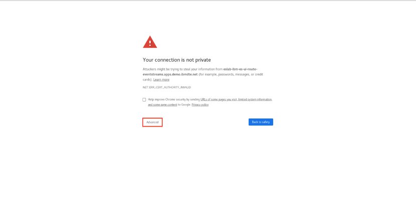
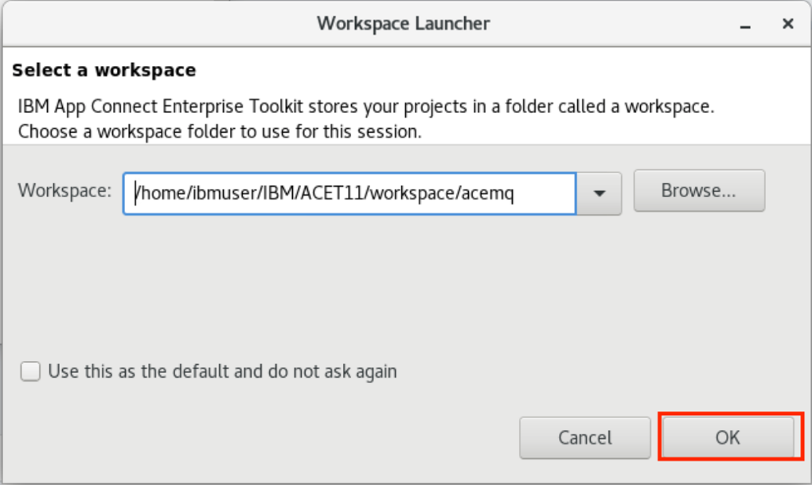
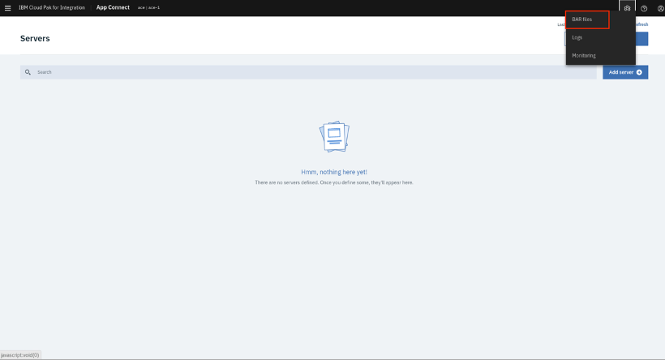

**Implement enterprise grade messaging that is secure and reliable for
any application across your backend integration architecture**

Modern applications and APIs all **need** the ability to communicate
data reliably between mission critical systems across internal/external
data sources, networks, and regions. In mission critical environments
your messaging infrastructure must be robust, reliable, and secure with
the ability to integrate into your applications and APIs at pace and
scale. In this tutorial, you create a message queue that receiving order
data from an API call to a retail ordering system. The red box in the
diagram shows what you are creating and where it fits in the overall
architecture of a mobile retail buying application.

In this tutorial, you will explore the following key capabilities:

-   Explore multiple integration capabilities within a single platform.

-   Create an integration flow that connects to a message queue.

-   Deploy the integration flow as a container in Kubernetes

-   Check the message using MQ Web Console

-   Check this message using Operational Dashboard (tracing)

Task 1 - Start the Environment

As this is a new deployment of the IBM Cloud Pak for Integration, you
must execute some steps to prepare the environment. Initial setup steps
are only needed for a fresh installation of the platform. They do not
need to be repeated.

IBM Cloud Pak for Integration offers a single, unified platform for all
your enterprise integration needs. It deploys integration capabilities
into the Red Hat OpenShift managed container environment and uses the
monitoring, logging, and security systems of OpenShift to ensure
consistency across all integration solutions

All work for this lab uses IBM Cloud Pak for Integration on OpenShift.
Open the **Developer Machine** VM by clicking the tile.

1.  If the environment is already up and running when you open your
    reservation link, skip to step 3. If it is not running, continue to
    the next step.

2.  Click the Run VM(s) button as shown below to start the virtual
    machine environment that is used for this lab.\
    

3.  Once the virtual machine starts, click the Developer Machine tile to
    start your lab exercise.\
    

4.  Log in to the Linux desktop with userid: **ibmuser** and
    password: **passw0rd**

Task 2 - Explore the platform capabilities

IBM Cloud Pak for Integration provides a single solution for all of your
enterprise integration needs. The platform provides a comprehensive set
of industry-leading capabilities. Combine powerful integration
capabilities to create, manage, and monitor all of your integrations
across applications, messaging, events, APIs, and more.

Unlock the power of your data and support the scale that is required to
grow all of your integration and digital transformation initiatives

1.  Open a browser (we recommend: **Chrome**) and click** **the IBM
    Cloud Pak for Integration bookmark in the bookmarks bar at the top.
    You might receive a login screen. Type as user: **admin** and
    password: **passw0rd.**

2.  Click **View Instance **on the Cloud Pak for Integration Main Page.
    You can see the list of instances
    available.

3.  The list of installed instances is displayed. The list includes:API
    Connect, App Connect , message queues, and Kafka event streams. For
    this lab, we work with IBM MQ, IBM App Connect, and Tracing
    (Operational Dashboard). Click **mq-1 **to work with MQ.

\
You might see this warning (**Your connection is not private**).
Click **Advance.**

Click the link : **Proceed to mq-1-ibm-mq-web-mq.apps.demo.ibmdte.net
(unsafe).**

Task 3 -- Create a message using MQ Console

In this task, you navigate to the MQ Console and check the MQ
configuration. You create the queue which accepts the resulting data
from the call to the **\"NEWORDER\"** API.

1.  In the MQ Console page (**mq** is the name of queue manager), if you
    see **Queues on mq, **skip to step 3.Otherwise, click the **Add
    Widget** button.\
    

2.  Click** Queues** to create a queue. You can add different widgets
    into MQ Console, including mq objects such as: charts, queues,
    topics, listeners, channels, etc. and make all necessary
    configurations.\
    

3.  Take a moment and review the MQ Console, which is you can administer
    the MQ server. ** **On** Queues on mq **,click **Create(+) **to
    create a queue for **mq** queue manager.** **\
    

4.  In the pop-up window shows up and type the local queue
    name **NEWORDER**. Click **Create** .\
    

5.  You see the new queue (NEWORDER), take a look at Queue depth .
    Notice it should be **0**.\
    

6.  You need some MQ information. MQ was installed as helm releases.
    You  have to open Cloud Pak common services

    1.  Open a browser and select the Cloud Pak on bookmark bar.\
        

    2.  Click **Monitor Health** and then **Helm Releases**.\
        

    3.  Type **mq-1** to search the MQ Helm release and click the mq-1
        instance.\
        

    4.  Scroll down to the bottom of page, make a note of the queue
        manager hostname and mq listener port.\
        

 

Task 4 - Modify the Order ACE Flow (integration)

In this task take an existing integration flow in ACE and modify it to
send only the payload data to the NEWORDER queue.

1.  In the terminal window, type **ace toolkit** to open the App Connect
    Enterprise Toolkit.

2.  In the Workspace Launcher window, choose the workspace
    /home/ibmuser/IBM/ACET11/workspace/acemq**. **Click OK.\
    

3.  Double-click **neworder \> Resources \> Subflows \>
    getId.subflow** on the left pane.\
    

4.  Click the MQ Output tile. In the lower-right, open the Properties
    tab and click** Basic. Note **the queue name:** NEWORDER.**\
    

5.  **Click **the MQ Connection parameter and verify the following
    settings:

    1.  Connection\*: Select **MQ client connection properties** from
        the drop-down.

    2.  Destination queue manager name: mq (case-sensitive).

    3.  Queue manager hostname: mq-1-ibm-mq.mq.svc

    4.  Listener: 1414

    5.  Channel name: **SYSTEM.DEF.SRVCONN** (Server Connection).\
        

6.  Save your flow. Click the** **save button.\
    

7.  Now, you need to generate a bar (broker archive) file. The App
    Connect Enterprise server uses BAR (Broker Archive) files to save
    compiled message flows, libraries, etc. We have created a file
    neworder.bar for this lab. In the Application Development window in
    the upper-left, on neworder application, right-click and
    select** New** then **BAR File** .\
    

8.  On the Window New Bar file, type the name of bar
    file: **neworder.**\
    

9.  ACE opens a window: **Prepare window**

    1.  Check REST APIs

    2.  Check **Compile and inline** resources

    3.  Click **Build and Save**

    4.  A popup window will display "**Operation completed
        successfully.**"

    5.  Click **Ok **and exit out of the toolkit.\
        ACE Toolkit saves and compile message flows, sub flows into a
        BAR file.\
        

 

Task 5 - Deploy the neworder integration flow

In this task deploy the integration flow as App Connect Enterprise
containers running in Kubernetes on the Cloud Pak for Integration. You
then test the integration API by calling the API to create a neworder
and confirm the response payload and data in the queue.

1.  In your browser, **return** to the IBM Cloud Pak for Integration
    bookmark**. **Under** View Instances,  **select the App Connect line
    and click **ace-1** instance.\
    

2.  When you deploy a BAR file, you create a new instance of App Connect
    Enterprise. Click **Add Server**.\
    

3.  Add a BAR file to deploy on ACE Server.\
    

4.  You might receive this warning message. If you do not see this
    message ignore this step and go the **Add Server** task (task 9). 
    It means that there is already BAR file installed. Click **(x) **to
    close the window.\
    

5.  Click the settings icon on the top right and select **BAR files**.\
    

6.  You see the Not deployed BAR file, click **(...) **and
    select **Delete BAR ..**\
    

7.  Click **Import BAR .**\
    

8.  On **Open file, **select
    /home/ibmuser/IBM/ACET11/workspace/acemq/BARFiles and then
    select **neworder.bar.**\
    

9.  Click **Import** to import BAR File to ACE Dashboard to start the
    deployment.\
    

10. Click the copy icon (1) and then click **Configure release**. Your
    URL is different than the one displayed below .\
    

11. Type the following:

    1.  Helm release name: **neworder**

    2.  Target namespace: **ace**

    3.  Target cluster: **local-cluster.**

    4.  Complete the check box under **License**\
        

12. Expand **All parameters** section and type the following:

    1.  Paste the URL that you copied in step 10.

    2.  Select which type of image to run: **App Connect Enterprise with
        MQ Client.**\
        

13. In the Images section, define images to be used. Keep all dockers
    images as default. Type the following:

    1.  Image pull policy: **Always**

    2.  Image pull secret: **prod-secret.**\
        

14. In the Persistence setting section, for r this use case you will not
    use Persistence:

    1.  Uncheck Enable Persistence

    2.  Uncheck Use dynamic provisioning.\
        

15. In the Operations Dasboard section, keep all parameters as default
    until you're ready to enable the Dashboard. To enable the IBM Cloud
    Pak for Integration Operations Dashboard (**Tracing**):

    1.  Check Enable Operational Dashboard

    2.  Type the Operational Dashboard namespace: **tracing**

    3.  Click **Install.**\
        

16. **View **the progress of the installation via Helm Releases as
    prompted (or use oc commands).You see the Helm Releases. **Type** on
    search releases: neworder and click the **neworder** line.\
    

17. Let's navigate the Operations Dashboard. IBM Cloud Pak for
    Integration bookmark bar. Click the **tracing** link.\
    

18. The Operations Dashboard collects data from all the registered
    capabilities (such as MQ) in real time. By default, and for this
    lab, 10 percent of traffic is sampled. You see the **Operational
    Dashboard Overview**.\
    

19. Keep this browser opened as you will use it later on. On the left
    you see the Operations Dashboard menu. You see all options you can
    use in Operations Dashboard. (If you are interested in Operations
    Dashboard (tracing), you make an exercise for this).\
    

20. Select the IBM Cloud Pak for Integration bookmark bar, under view
    instances, click the **ace-1 **instance.

21. On Servers (ACE), you see the BAR file running as an
    application **neworder. **Check **Started **and then click
    the **neworder** icon .\
    

22. Click the **neworder api** icon.\
    

23. To start the ACE API, **click** the REST API Base URL link.\
    

24. A browser window will open, displaying a 404 Not Found error. This
    is because the API requires an orderid variable in the URL. Modify
    the URL and add a random string, such as **0000**. After you
    click **Enter**, you will see the proper response from the API
    call.\
    

25. Open a new browser window and select the IBM Cloud Pak for
    Integration bookmark bar, under **view instances** and 
    click **mq-1 ** instance.\
    

26. You see a new message has arrived in **NEWORDER** queue.\
    

27. Back to the browser with Operations Dashboard opened.
    Click **Overview** option and you see all the tracing of **MQ, App
    Connect and APIC** (You will see how to configure tracing in APIC
    lab). Operations Dashboard Add-on is based on Jaeger open source
    project and the OpenTracing standard to monitor and troubleshoot
    microservices-based distributed systems. Operations Dashboard can
    distinguish call paths and latencies. DevOps personnel, developers,
    and performance engineers now have one tool to visualize throughput
    and latency across integration components that run on Cloud Pak for
    Integration. Cloud Pak for Integration - Operations Dashboard Add-on
    is designed to help organizations that need to meet and ensure
    maximum service availability and react quickly to any variations in
    their systems.\
    

Summary

 You\'ve completed this tutorial. In this lab you learned how to:

1.   Increase efficiency by creating, testing, and debugging an
    integration flow with a message queue within a single, unified
    experience

2.   Increase scale by deploying integration flows and message queues as
    containers on Kubernetes.

3.   Use Helm, the industry standard for Kubernetes package manager, to
    deploy the integration.

To try out more labs go to the [Cloud Integration
DTE](https://ibm-dte.mybluemix.net/cloud-integration-platform). To try
out more labs, go to [Cloud Pak
for](https://www.ibm.com/demos/collection/IBM-Cloud-Pak-for-Integration/) [Integration
Demos](https://www.ibm.com/demos/collection/IBM-Cloud-Pak-for-Integration/).
For more information about the Cloud Pak for Integration, go
to <https://www.ibm.com/cloud/cloud-pak-for-integration>.  

\
