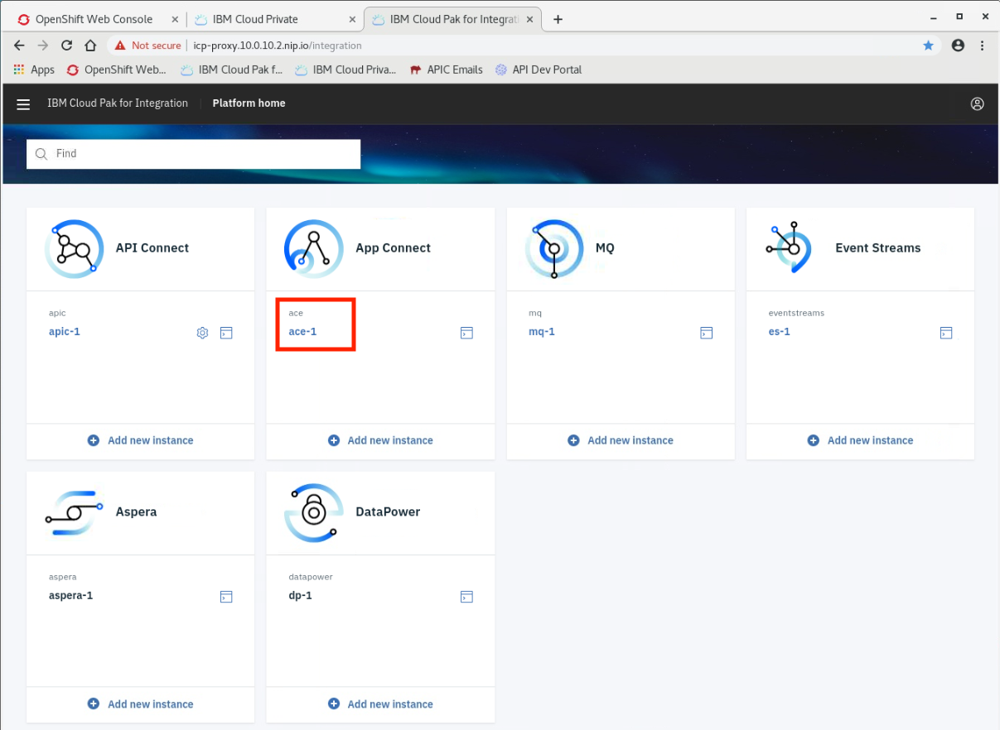
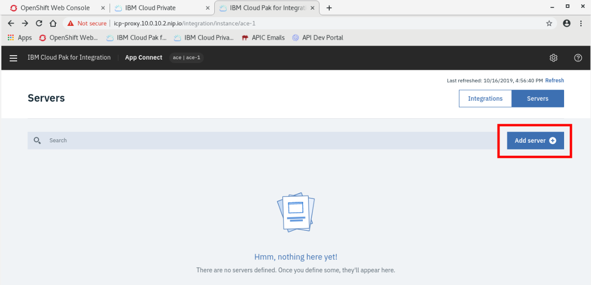
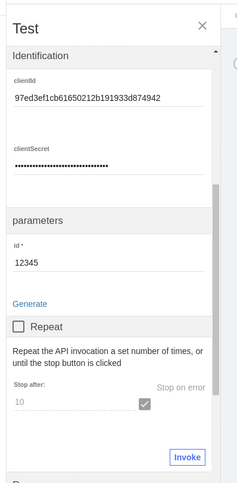
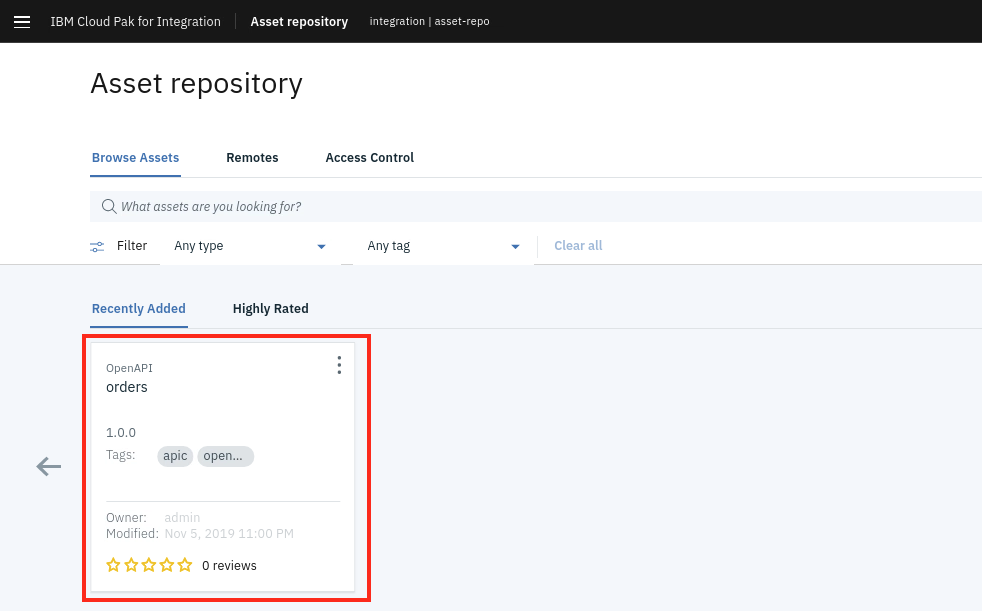

**Extend your back-end integrations securely to partners and
developers.**

Extending access via APIs to your back-end integrations empower your
partners and developer community to create new business value, technical
value, and customer experiences for your products and offerings. Spur
innovations where a number of technologies are combined to create
something new, for example, extending the ability apply for loan
pre-approvals that can be utilized within apps that search for cars or
real estate. To do this, you must first create the back-end
integrations, which combine data from existing core systems, disparate
assets, or SaaS services with the ability to send critical data between
systems reliably. Second, you need to provide APIs to your back-end
integrations that secure access and apply rate limits.. 

In this tutorial, you will learn how to deploy an app integration flow
that takes data from one source and sends it to a message queue for
reliable delivery. Then you will expose this integration as a
rate-limited API secured by a key and secret. This integration flow is
deployed **quickly and easily** as an independent, **auto-scalable
microservice** running on **containers**. By utilizing Kubernetes as a
foundation, Cloud Pak for Integration takes advantage of the native
monitoring and auto-scaling capabilities. Furthermore, you will have an
opportunity to** learn Helm, the industry standard Kubernetes package
manager**, which is used to manage your integration as a Kubernetes
application.

In this tutorial, you will explore the following key capabilities:

-   Explore multiple integration capabilities within a single platform.

-   Create an integration flow between a public cloud service and
    on-prem message queue.

-   Deploy the integration flow as a microservice using Helm.

-   Provide access to the integration flow as a secure API.

### [Initial Setup Steps] 

As this is a new deployment of the Cloud Pak for Integration, you must
execute some steps to prepare the environment. Initial setup steps are
only needed for a fresh installation of the platform. They do not need
to be repeated.

All work for this lab will be done on the Developer Machine. Open
the **Developer Machine** VM by clicking the tile.

 

**Start The Environment**

1.  When you open your reservation link, if the environment is already
    up and running already, please skip to step 3. If it is not running,
    continue to step 2

2.  **Click** the [[Run
    VM(s)]] button as
    shown below to start the virtual machine environment that will be
    used for this
    lab. 

3.  Once the virtual machine has started, **click** the [Developer
    Machine]** **tile to start your lab
    exercise.  

4.  **Login** as
    user [[ibmuser]],
    password [[engageibm]].

5.  **Right-click** on
    the [[Terminal]] icon
    on the desktop and
    choose [[Open]].

6.  In the terminal window, **cd** to
    the [[startup-scripts]] directory
    and run the startup
    script [oc-startup.sh]** **

**Confirm the Integration Cloud is up and running.**

1.  Type[**  **[oc get pods -n
    integration]] 
    to see a list of all the pods running in the Integration namespace.
    Each pod should have all of its containers **Ready** with a status
    of **Running**. 

**Configure Message Queue (MQ) to Authorize and Accept Data.**

1.  As this is a brand new deployment of the Cloud Pak for Integration,
    all instances of integrations, message queues, and event streams are
    deployed as microservices. We need to authorize the Message Queue
    service to accept incoming data from the integration running on a
    separate server. In
    the [[/home/ibmuser/]] directory,
    type [[./loadmqace.sh. ]] 

2.  Make sure that the MQ configuration has been
    loaded. 

**Sync Helm Repositories**

1.  The Helm repositories must be resynchronized between the repository
    and the server. Click the **Search your computer** icon at the
    top-left and then search for **Google Chrome**. Launch the Chrome
    browser by clicking the **Google Chrome** icon.

2.  Click the **IBM Cloud Private
    bookmark**.  

3.  The username and password are
    both [[admin]] which
    will be pre-filled. Click[[ Log
    in]].  

4.  Click the **main menu **icon at the
    top-left.  

5.  Click [[Manage -\> Helm
    Repositories.  ]]

6.  Click [[Sync
    all]].
    Click [[Sync]] in
    the new window to
    confirm.  

### [Explore the platform capabilities] 

Cloud Pak for Integration provides a single solution for all of your
enterprise integration needs. The platform provides a comprehensive set
of industry-leading capabilities. Use any of them on their own or
together through a single interface. Create, manage, and monitor all of
your integrations across SaaS applications, messaging, streams, APIs,
high-speed transfer, and more.

Unlock the power of your data and support the scale required for all of
your integration and digital transformation initiatives.

 

 

 

1.  **Click** the [IBM Cloud Pak for
    Integration]** **bookmark** **in the
    bookmarks bar at the top. If you see the login page, please continue
    to step 3. If instead you see the [[Your connection is not
    private]] page,
    there is an issue reading a certificate. The certificate will not
    affect this lab, so you may proceed
    and **click** [[Advanced]]      

2.  **Click** [[Proceed to icp-proxy.10.0.10.2.nip.io
    (unsafe)]].
     
      
     

3.  The login screen for IBM Cloud Private will be displayed. For
    both **Username** and [[Password]] enter **admin**.
    Click **login**. After logging in, the **Cloud Pak for
    Integration** Home page is loaded. This is referred to as
    the** Platform Navigator**. From here you are able to navigate to
    all the integration and development technology contained within the
    platform. Today, this is API management, application integration,
    message queues, and Kafka event streams. For this lab, we will work
    with IBM MQ and IBM API Connect.   

### [Deploy the app integration flow] 

This task will cover opening and examining an application integration
flow in the [IBM App Connect Enterprise
Toolkit](https://developer.ibm.com/integration/docs/app-connect-enterprise/get-started/).
With the Toolkit you can build powerful and complex integration
applications, services, and APIs quickly and easily using a visual
designer. Your integration solutions can be directly deployed to the
Cloud Pak for Integration on IBM Cloud Private running on-premise, in
any cloud, or combinations of both.

**View the Application Integration flow**

1.  In the terminal window, **type** [[ace
    toolkit]] to
    open the App Connect Enterprise Toolkit.

2.  In the Workspace Launcher window, choose the
    workspace [[/home/student/IBM/workspace/ace-apic.]] **Click** [[OK]].
       
     

3.  The toolkit will open the project. To view the integration flow that
    you will deploy, click **orders -\> Resources -\> Subflows
    -\> New\_Order.subflow.** The flow calls a web-service running in
    the cloud, strips the header, and sends the data to a queue running
    in the platform. To learn more about the App Connect Enterprise
    (ACE) toolkit, visit the [App Connect DTE
    page](https://ibm-dte.mybluemix.net/cloud-integration).
       

4.  In the Application Development view on the left,
    expand **Independent Resources -\> BARfiles -\> BARs**. The
    orders.bar file displayed is the export of this flow, which will be
    used to deploy this flow to the integration server.
       

**Deploy Integration BAR file as containers.**

1.  Go back to Cloud Integration Home in the
    browser. **Click** [[ace-1. ]]

2.  Now we will deploy the orders.bar file you saw
    above. **Click** [[Add server
     ]]  

3.  **Click** the box [[Add a BAR file
     ]]  

4.  **Select **the
    file [[orders.bar]] and **click** [[Open]]     

5.  Continue the deployment
    by **clicking** [[Continue ]]

6.  A pop-up window containing a Content URL will appear.
    First, **click** the clipboard icon to copy the URL (this is
    important!). Your URL will be different than the one displayed
    below. Then, **click** [[Configure
    release]].
      
     

7.  The next screen contains information about the IBM App Connect
    Enterprise Helm chart. This chart deploys a single IBM App Connect
    Enterprise Integration xerver into the Kubernetes environment.
    Click **Configure**.  

8.  In the next few steps we\'ll configure the Helm release (do not
    click** **[Install]** **yet**)**

    1.  Helm Release
        name:  [[orders]]

    2.  Target
        Namespace: [[ace]].

    3.  Check as [**Target Cluster
        : **[local-cluster]]

    4.  Check the [License
        agreement]** **checkbox.

    5.  You may safely ignore the two \"Pod Security\" warnings.
               

9.  Scroll down to **Parameters**.

    1.  In the \"Content Server URL field,\" paste the Content URL
        copied above. 

    2.  In the \"Proxy Node IP or FQDN field,\"
        enter [[icp-proxy.10.0.10.2.nip.io
         ]]
        [[ ]]

10. **Scroll down** and click [[All
    parameters]]:

    1.  **Check** the [[Production
        Usage]] checkbox.

    2.  **Check** the [[Local Default Queue
        Manager ]]checkbox**.
         ** ** **

11. Scroll down to \"Docker Image\" settings.

    1.  Change Image pull policy
        to: [[Always]]

    2.  **Type** Image Pull
        Secret:[** **[deployer-dockercfg-bnjx2 ]]

12. Scroll down to \"Configuration for ACE\"

    1.  Change [[\"]]replica
        count\"[[ ]]to[[ 1]].
        This number represents the number of pods that must always be up
        and running. 

13. Scroll down to \"Persistence Settings.\"

    1.  **Uncheck** [[Enable
        persistence]]

    2.  [**Uncheck  **[Dynamic
        provisioning ]]

14. We are ready to begin the deployment. Click the **Install** button
    at lower right.

15. An \"Installation started\" dialog will be displayed. Click [[View
    Helm
    Release]] to
    view the status of all the components of this Helm deployment.
       

16. Go back to the IBM Cloud Integration browser tab.
    Click [[Done]].
       

17. The orders integration server is now started and running. 

**Test the integration** 

1.  Return to the Cloud Pak for Integration dashboard and click the
    ace-1 server.  

2.  Click
    the [[orders]] server.  

3.  Click [[orders
    API]].  

4.  This page displays the REST API Base URL, a link to the OpenAPI
    document, and the paths in this API. (Your port number will be
    different from that in the example below.) We will use the base URL
    (in the example
    below: [[http://icp-proxy.10.0.10.2.nip.io:30497/neworder/v1/create]])
    in the next step.
       

5.  From the terminal window, execute the following curl command
    (replacing \"30497\" with your port number): [[curl -k
    -d\'\]}}\' \--request
    POST \--url
    http://icp-proxy.10.0.10.2.nip.io:30497/neworder/v1/create]]    

6.  If the API call is successful, you will see JSON reply with
    \"Order - ok\" at the end.  

 

### [Create a secure API for the app integration] 

We\'ve created an application integration flow and successfully called
it via a REST API call! Now, in order to make it accessible to the rest
of the world, it\'s important to add security around it---at least in
the form of a client ID and secret. This way, in addition to access
control, you can get insights into which teams or customers are the
least and most active. Adding security to an API is simply done via an
OpenAPI configuration parameter. We can add rate limits to the API to
increase the calls per second, minute, or hour to scale up as much as
you need.

In this task, you will create security for this integration, package it
into a product with rate limits, and distribute it via a developer
portal.

 

1.  Go back to the browser window where you have the orders API window
    open. Click the URL under **OpenAPI
    document**.   

2.  A new browser tab will open, containing the swagger file.
    Right-click anywhere in the body of the text and choose [[Save
    as\...]]   

3.  Click [[Save]] to
    save the swagger
    file. 

4.  Go back to the Cloud Pak for Integration page. Click the main menu
    icon, then click [[API
    Connect]],
    then
    click [[apic-1]].
       

5.  Click [[Develop APIs and
    Products]].  

6.  Click [[Add]],
    then
    choose [[API]] from
    the drop-down
    menu. 

7.  Choose [[From an existing OpenAPI
    service]],
    then
    click [[Next]]. 

8.  Click [[Browse]] and
    select the downloaded swagger file.
     

9.  Make sure the JSON is successfully validated and then
    click [[Next]]. 

10. Keep all the default values and
    click [[Next]].
     

11. Keep the default settings under \"Secure using Client ID\" and
    \"CORS.\"
    Click [[Next]].

12. Your API with Client ID is created! Click [[Edit
    API]]. 

13. Go to **Security Definitions**. The API key \"ClientID\" was made
    during the creation process. To further secure the API,
    click [[Add]] to
    add a secret.  

14. Fill in these parameters for the new secret:

    1.  Name: [[Secret]]

    2.  Type: [[API
        Key]]

    3.  Located
        in:[** **[Header]]

    4.  Parameter
        name: [[X-IBM-Client-Secret]]

    5.  Click [[Save]].[[ ]]     

15. Click [[Security]].
    Select [Secret]**,** then
    click [[Save]].
       

16. Click [[Properties]].
    Then
    click [[target-url]].
     

17. Verify that the Default value
    is [[https://icp-proxy.10.0.10.2.nip.io:30497]].
    (Your port number will be different from the \"30497\" in the
    example below.) Then
    click [[Assemble]].
     

18. Click the **Test** button. This opens the test panel on the left.
     
    API Test Button

 

19. From here, you will run a quick functional test to make sure
    everything is working. Click **Activate API**.
       

20. After the API is published, the Catalog, Product, Plan, and
    Application are displayed under setup. The default plan has a rate
    limit of 100 calls per hour. Under Operation, choose [[get
    /]].
       

21. The clientId and clientSecret fields will auto-populate with the
    test application values. Under parameters for the id enter an string
    of alphanumeric characters (i.e. 12345).
     
     [[ ]]  

22. Since we have not set up any certificates, you may see a message
    stating **No response received**. Click the link to open it in a new
    browser tab and click **Advanced** to accept the self signed
    certificate. Close the browser tab and
    click [[Invoke]] again.

23. You should successfully see a status code 200 created with a
    response body containing the order details.
     

 

### [Share the API] 

Now that you\'ve built, secured, published, and tested your API, the
last step is to add it to the Asset Repository. With the Asset
Repository, your organization can store, manage, and share all of your
integration assets in one central location. Sharing assets in this way
increases collaboration between teams, avoids unnecessary duplication
and boosts productivity.

1.  To push our new API to Asset Repository we must return to the API
    Manager. From the Cloud Pak for Integration home page,
    choose [[apic-1]] 

2.  In the API Manager screen, click [[Develop APIs and
    Products]]

3.  Returning to the Develop Screen, select the menu next to your API
    and from the drop down, click [[Push to asset
    repository]].
     

4.  Once the upload completes, you will see a success dialog at top
    right.  

5.  To access the Asset Repository, click on the main menu and
    select [[Asset
    Repository]] from
    the list of available capabilities, then choose
    integration [[asset-repo]]

6.  You will see the orders asset you pushed from API Connect in the
    previous tasks. 

7.  In order to help other users understand the value of your asset, we
    recommend that you review it. Reviews help your team gauge
    reliability and get additional information about how best to utilize
    the asset. To add a review, click on the ellipsis and choose
    \"Open\" from the drop-down menu.
     

8.  Click the Review
    menu. 

9.  In the \"My Review\" box, write the text of your review. Choose how
    many stars you want to give the review, then click
    Submit.

10. Once the review is added, you will see a success dialog at upper
    right. 

11. You've successfully added a review. Now your teammates know that
    this asset is reusable and reliable. Additional information about
    the asset is available in the sidebar including when the file was
    created, a description that explains the purpose and use, and any
    relevant tags.

### [Delete a BAR file on Cloud Pak] 

If you want to delete an ACE instance follow this steps, delete a Helm
Releases and delete a BAR file.

1.  **Click** the [IBM Cloud
    Private]** **bookmark in your browser.
    From the main menu **choose** [[Workloads \> Helm
    Releases]]. 

2.  On search, type [orders]**, click** on
    the ellipsis (** . . . **)
    and **click** [Delete]**. **

3.  **Click** the [[IBM Cloud Pak for
    Integration]] bookmark, **choose** the[** **[ace-1]] link.

4.  On [Servers]**, click** the
    settings** **icon** **and **choose** [Bar
    files]** **from the drop-down
    menu.

5.  Select which BAR files you wish to delete, **click** the ellipsis
    ( **. . . **) and click [[Delete
    BAR]] (Make
    sure the BAR file is not
    deployed**.) **

### [Summary] 

Congratulations! You have successfully completed this lab. In this lab
you learned how to:

-   Deploy a back-end integration to containers that are readily
    available as a scalable web service.

-   Secure access to the back-end integration by creating a secure,
    governed API using the OpenAPI definition of the integration.

-   Use API Test and Monitor to execute quick and easy functional
    testing of your new APIs.

Now that you've made your back-end integrations ready for external
distribution, your developer community will be able to access the APIs
via a developer portal. The developer portal is included in the platform
and provides a full-featured out-of-the-box experience to onboard and
nurture your API consumers.  To try out more labs, go
to [[C](https://ibm-dte.mybluemix.net/cloud-integration-platform)[loud
Pak for Integration
Demos](https://www.ibm.com/demos/collection/IBM-Cloud-Pak-for-Integration/)]. 
For more information about Cloud Pak for Integration, go
to <https://www.ibm.com/cloud/cloud-pak-for-integration>.

\
