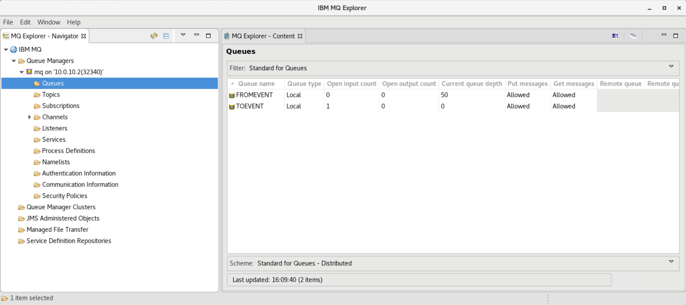

**Improve your customer experience by reacting to situations in real
time**

The most interesting and impactful new applications in an enterprise are
the applications that provide new ways of interacting with existing
systems by reacting in real-time to mission-critical data. Leverage your
existing investments, skills and even existing data, and use
event-driven techniques to offer more-responsive and more-personalized
experiences. IBM Event Streams has supported connectivity to the systems
you're already using. By combining the capabilities of IBM Event Streams
event streams and message queues, you can combine your transaction data
with real-time events to create applications and processes. These
applications  and processes will  allow you to react to situations
quickly and provide a greater personalized experience.

 

 

In this tutorial, you will create a bidirectional connection between MQ
and Event Streams by creating two message queues and two event stream
topics. One is for sending and one for receiving. You will then
configure the message queue source and sync connectors in order to
connect between the two instances. 

In this tutorial, you will explore the following key capabilities:

-   Configure MQ to send and receive messages and events

-   Configure Event Streams topics mqtoevent and eventtomq

-   Configure MQ Source and Sync Connectors.

-   Test connectors MQ source and sink (send a message and receive
    events).

Part 1 -- Initial Setup Steps

Because this is a new deployment of the Cloud Pak for Integration that
uses Red Hat OpenShift, you need to execute some steps to prepare the
environment. Initial setup steps are only needed for a fresh
installation of the Cloud Pak. They do not need to be repeated.

All work for this lab is done on the Developer Machine. Open
the **Developer Machine** virtual machine by clicking the tile.

**Start the Environment**

1.  When you open your reservation link, the environment should be up
    and running already and you can skip to step 3. If it is not
    running, proceed to Step 2.\
    

2.  Click the **run** button as shown below to start the virtual
    machine environment that is used for this lab.\
    

3.  Once the virtual machine start, click the **Developer Machine screen
    image** to start your lab exercise.

4.  Log in to the Linux desktop with userid: **ibmuser** and password:
    \"**engageibm\".**

**Confirm that the Integration Cloud is up and running.**

1.  Loading the Cloud Pak for Integration for the first time takes
    around 10 - 20 minutes to load. This is because it is loading a
    local Kubernetes cloud with the runtimes of all the integration
    capabilities that are installed for this environment. To check
    whether the environment is done loading, open a terminal console
    window by clicking the terminal icon in the app launcher on the
    upper-left and type
    /[**home/ibmuser/startup-scripts/oc-startup.sh[ ]**[.]]\
    

**Sync Helm Repositories**

1.  Click the **IBM Cloud Private bookmark**.  

2.  The username and password are
    both [[admin]],
    which are prefilled. Click[[ Log
    in]].  \
     

3.  Click the **main menu **icon at the
    upper-left.  

4.  Click [[Manage -\> Helm
    Repositories.  ]]

5.  Click [[Sync
    repositories]].
    Click [[OK]] in
    the new window to confirm.\
    

**Configure Message Queue (MQ) to Authorize and Accept Data.**

 

1.  Because this is a brand new deployment of the Cloud Pak for
    Integration, all instances of integrations, message queues, and
    event streams are deployed as microservices.You need to prep the
    Message Queue service to be authorized to accept data from the
    integration running on a separate server.
    Type [[./loadmqes.sh]] 
    and check the results:\
    

2.  You\'ve loaded the configuration.

Part 2 -- Configuring MQ

In this task, you work with MQ Console, create two queues (TOEVENT and
FROMEVENT), and change MQ Authorization.

1.  In your browser, click the **IBM Cloud Pak **bookmark and on
    the Cloud  Pak for Integration main page, locate the** MQ **service
    and click **mq-1.**

You might  receive the page below, click **Advanced
icon.**
Click **Proceed to icp-proxy.10.0.10.2.nip.io
(unsafe)** link.

2.  Click **mq-1 **to open MQ
    Console.

3.  You are on IBM MQ console and as user Administrator. You can create
    and configure MQ objects. Click the **Add
    widget** icon.

4.  To add a list of queues on MQ Console,
    select **Queues.**

5.  Take your time to be familiarized with MQ Console. In the **Queues
    on mq **window and check the queues (**FROMEVENT **and** TOEVENT**)
    created for this lab.

6.  Click menu icon (\"**Hamburger**\") \--\> **MQ **\--\> **1
    instance** \--\> **mq-1** \--\> ( **3 dots**) \--\> **Release
    details.**

7.  Locate service and copy connection information -- Listener
    port: **32340**

 

 

 

 

Part 3 -- Configuring Event Streams

In this task, you configure two topics on Event Streams (mqtoevent and
eventtomq). You use the Event Streams instance ( **es-1**) created for
this lab.

1.  In your browser, click the **IBM Cloud Pak Integration Bookmark**,
    on **Even Streams** window, click **es-1**  .

    1.  (If you see the message \"es-1 did not load correctly\",
        click **[Open es-1]**. This issue
        might occur sometimes when using a self-signed certificate such
        as in this demo environment. This loads es-1( in a new tab.
        After the new tab is loaded, come back to this tab and
        click **[Try again]**.) 

2.  You will create Event Streams topics and look at the lower-right to
    check that the **System is healthy.** Click  **Topics**.

3.  On the topics page, click **Create topic** .

4.  For our lab you need 2 topics. You can use Advanced button and
    create the topic

    1.  **Topic Name **field**, **type: **mqtoevent **

    2.  **Partitions**: **1** (A partition is an ordered list of
        messages )

    3.  **Replicas: 3  **(In order to improve availability, each topic
        can be replicated onto multiple brokers)

    4.  **Minimum in-sync replicas: 2 **- (In order to improve
        availability, each topic can be replicated onto multiple
        brokers)

    5.  **Retention time: 10 minutes **-** **(Is how long messages are
        retained before they are deleted.)\
        

5.  Scroll Down and click **Create topic**.\
    

6.  On the topics page, take your time and check the message **"Topic
    creation requested" **and** **the** topic mqtoevent. **You need one
    more topic and click **Create topic**.

7.  Do the same for the new topic:

    1.  **Topic Name **field**, **type: **eventtomq**

    2.  **Partitions**: **1** (A partition is an ordered list of
        messages )

    3.  **Replicas: 3  **(In order to improve availability, each topic
        can be replicated onto multiple brokers)

    4.  **Miminum in-sync replicas: 2 **- (In order to improve
        availability, each topic can be replicated onto multiple
        brokers) 

    5.  **Retention time: 10 minutes - **(is how long messages are
        retained before they are deleted.)

    6.  Click **Create topic**

8.  Now you created two topics: **mqtoevent** and **eventtomq.**

 

Part 4 -- Installing Kafka MQ connectors (source and sink)

Kafka Connect connectors that run inside a Java process called a worker.
These instructions focus on stand-alone mode because it\'s easier to see
what's going on. You will use a Kafka connector stand-alone (already
installed for this lab).

The connectors (sink and source) configuration file contain the
properties that are needed for each connector. For this lab, you need to
configure MQ Kafka Connectors.

Source
connector: [https://github.com/ibm-messaging/kafka-connect-mq-source/tree/master/co...](https://github.com/ibm-messaging/kafka-connect-mq-source/tree/master/config)

Sink
connector: [https://github.com/ibm-messaging/kafka-connect-mq-sink/tree/master/conf...](https://github.com/ibm-messaging/kafka-connect-mq-sink/tree/master/config)

1.  Select **Toolbox** and scroll down to the **Connectors **tile
    click **Add
    Connectors.**

2.  On page **Add Connectors to your Kafka Connect enviroment** ,
    click **IBM MQ connectors** link
    .

3.  On IBM MQ connectors. You can download MQ source and MQ sink
    connector. MQ Source connector messages from MQ to Event Streams and
    MQ Sink Connector events from Event Streams to MQ. Click **Download
    MQ Source JAR**. The
    file: **kafka-connect-mq-source-1.1.0-jar-with-dependencies.jar **is
    on** /home/ibmuser/Downloads.**

4.  Click **MQ Sink** icon and click **Download MQ Sink JAR . **The
    file: **kafka-connect-mq-sink-1.1.0-jar-with-dependencies.jar **is
    on** /home/ibmuser/Downloads.**

5.  Open a terminal and copy them to the **/home/ibmuser** directory:

    1.  **cp
        /home/ibmuser/Downloads/kafka-connect-mq-source-1.1.0-jar-with-dependencies.jar
        /home/ibmuser**

    2.  **cp
        /home/ibmuser/Downloads/kafka-connect-mq-sink-1.1.0-jar-with-dependencies.jar
        /home/ibmuser**\
        \
         

6.  You need to configure sink and source connectors. Download **MQ
    sink **and **MQ source** configuration connectors from Github.

    1.  Create the sink connector using
        : <https://github.com/ibm-messaging/kafka-connect-mq-sink/tree/master/config>\
         **Note**: **You may copy this file from
        /home/ibmuser/files** (**cp
        /home/ibmuser/files/mq-sink.properties**[ ](https://github.com/ibm-messaging/kafka-connect-mq-sink/tree/master/config)**/home/ibmuser** ). And
        go to step 3.

        1.  Click
            mq-sink.properties

        2.   Click the RAW
            button.

        3.  Save as mq-sink.properties in  /home/ibmuser
            directory

    2.  Create the source connector using
        : [[https://github.com/ibm-me](https://github.com/ibm-messaging/kafka-connect-mq-source/tree/master/config)[ssaging/kafka-connect-mq-source/tree/master/config](https://github.com/ibm-messaging/kafka-connect-mq-source/tree/master/config)]

        1.  Repeat the previous steps, click mq-source.properties and
            click the RAW button and save as **mq-source.properties** in
            /home/ibmuser directory.\
            **Note**: **You may copy  this file from
            /home/ibmuser/files** (**cp
            /home/ibmuser/files/mq-source.properties/home/ibmuser** ).

Part 5 -- Create API Key and Event Streams certificate (Event Streams
Operations)

You downloaded Kafka sink and source connectors (.jar files) and MQ sink
and source configuration.

You need some security parameters to execute Kafka Connectors.

1.  In your browser, click I**BM Cloud Pak for Integration** Bookmark
    and open **es-1** in **Event Streams **window. Click **Topics **link
    and  click **Connect to this cluster** link .\
    

2.  In order to connect the MQ, you need the bootstrap server, a
    certificate, and an API
    Key.

3.  Create an API key. Type the **Name of your
    application**: **mqtoeventapp. **When you start to type the name of
    your application, a list of options are displayed. Select **Produce
    and consume.**

4.  Type the name of topic in **Which topic ? **as** mqtoevent **and
    click **Next **to confirm the topic..\
    

5.  Click **Generate API Key**. API Key has the permission to access the
    topic.\
    

6.  Event Streams generates an API Key to connect your application (MQ).
    Click the **download icon** and go to **/home/ibmuser/Downloads** to
    change the name **es-api-key.json **to** mqtoevent.json. (**use** mv
    es-api-key.json mqtoevent.json )**\
    

7.  On the same page, go to **Certificates** and Java truststore and
    click to download icon the **Truststore password
    .** Copy **bootstrap server (icp-proxy.10.0.10.2.nip.io). **Close
    the window by clicking (**x**).\
    

8.  Go back to **es-1 **main page. Click **Connect to this cluster.**

9.  Repeat steps 3,4,5 and 6 :

    1.  Application name: **eventtomqapp.**

    2.  Select **producer and consumer.**

    3.  Type tne name of topic in **Which topic ? **as** eventtomq**

    4.  Generate an Api-key and donwload es-api-key.json and rename
        as **eventtomq.json  **(use **mv
        es-api-key.json** **eventtomq.json )**

    5.  **Do not Download Java truststore. (you did already).**

Part 6 -- Configuring Kafka Connectors properties (sink and source)

There are two configuration files for each connector. The Kafka
connector configuration file contains the properties that are needed to
connect to Kafka. The MQ connector configuration file contains the
properties that are needed for the connector.

Configuring Kafka source connector (source is a producer and sink is a
consumer) :

1.  Open a terminal window, go to /home/ibmuser/Downloads and edit (use
    gedit): **gedit mqtoevent.json **copy the api\_key.\
    

2.  From the terminal window, go to
    the **home/ibmuser/kafka\_2.11-2.3.0/config/ **directory. Edit (use
    gedit): **gedit connect-standalone-source.properties** (this file
    was prepared for your lab): There are two sessions that you need to
    configure **ssl** and **produce.**

    -   The first session that you configure **security**:

        -   Type
            the **bootstrap.servers**: **icp-proxy.10.0.10.2.nip.io:32639**

        -   You downloaded **es-cert.jks** and should be
            on** /home/ibmuser/Downloads**: **ssl.truststore.location=/home/ibmuser/Downloads/es-cert.jks.**

        -   You need to type **API Key password** (or  paste api key)
            for **mqtoevent **topic** **. The password should be
            different.** **Type
            as **sasl.jaas.config=org.apache.kafka.common.security.plain.PlainLoginModule
            required username=\"token\"
            password**=\"***rq-inNFNb-ahK-Q4Rha-Kd\_Oh1dDMPiyEKQADkNNTFEd***\";

    -   The second session that you configure **producer:**

        -   **producer.ssl.truststore.location=/home/ibmuser/Downloads/es-cert.jks.**

        -   You need to type **API Key password** (or  paste api key)
            for **mqtoevent **topic** **.**Your password should be
            different.
            producer.sasl.jaas.config=org.apache.kafka.common.security.plain.PlainLoginModule
            required username=\"token\"
            password=\"*****rq-inNFNb-ahK-Q4Rha-Kd\_Oh1dDMPiyEKQADkNNTFEd***\"
            .\
             

3.  Click **Save** to save the file and then **close** it.\
    Configuring Kafka sink connector: (similar as **producer
    configuration**)\
    ***Note: Each connector has different api key .***\
    ***Note: es-cert,jks is the same for consumer and producer.***

4.  Open a terminal window and go to /home/ibmuser/Downloads and edit
    (use gedit): **gedit eventtomq.json **copy the api\_key
    and **Close.**\
    

5.  From the terminal window, change to the Kafka root directory and go
    to **home/ibmuser/kafka\_2.11-2.3.0/config/** directory, edit (use
    gedit): **gedit** **connect-standalone-sink.properties** (this file
    has been prepared for our lab). There are two sessions that you need
    to configure **ssl** and **consumer.**

    -   The first session that you configure the **security**:

        -   Type 
            the **bootstrap.servers**: **icp-proxy.10.0.10.2.nip.io:32639**

        -   You downloaded es-cert.jks and should be on
            /home/ibmuser/Downloads. **ssl.truststore.location**=/**home/ibmuser/Downloads/es-cert.jks**

        -   You need to type API Key password (or paste api key)
            for **eventtomq **topic.**The password should be
            different. **\
            **sasl.jaas
            .config=org.apache.kafka.common.security.plain.PlainLoginModule
            required username=\"token\"
            password**=\"***DFjgYR11wKLb4ot5XafabNcKhWdmzUl-r9Ouw8TQ51nd***\"

    -   The second session that you configure the** consumer:**

        -   **consumer.ssl.truststore.location**=/home/ibmuser/Downloads/es-cert.jks

        -   You downloaded es-cert.jks and should be on
            /home/ibmuser/Downloads. **ssl.truststore.location**=/**home/ibmuser/Downloads/es-cert.jks**

        -   You need to type API Key password (or paste api key)
            for **eventtomq** topics.**Your password should be
            different. 
            consumer.sasl.jaas.config=org.apache.kafka.common.security.plain.PlainLoginModule
            required username=\"token\"
            password=\"*****DFjgYR11wKLb4ot5XafabNcKhWdmzUl-r9Ouw8TQ51nd***\".

6.  Click **Save** to save the file and then **close** it.

Part 7 -- Configuring MQ Connectors

The connector copies messages from a source MQ queue to a target Kafka
topic. There is also an MQ sink connector that takes messages from a
Kafka topic and transfers them to an MQ queue.

You installed in Developer Machine a local Kafka. You can check
on **/home/ibmuser**/**kafka\_2.11-2.3.0**. It is referred to as the
Kafka root directory. It contains several directories including bin for
the Kafka executables and config for the configuration files.

You now need to update the connector config file (mq-source.properties
and mq-sink.properties) for the value that is required to connect to
your queue manager.

1.  Configure **mq-source.properties** (*MQ to Event Streams*). Open a
    terminal window and go to /home/ibmuser directory and type **gedit
    mq-source.properties** .

2.  Open this file in a text editor and complete the required values as
    follows: (**Warning: Case Sensitive**)

    1.  mq.queue.manager=**mq**

    2.  mq.connection.name.list=**icp-console.10.0.10.2(32340)**

    3.  mq.channel.name=**TO.EVENT**

    4.  mq.queue=**TOEVENT**

    5.  topic=**mqtoevent .**

3.  Click **Save** to save the file and then **close** it.

4.  Configure **mq-sink.properties** (*Event Streams to MQ*). Open a
    terminal window and go to /home/ibmuser directory and type gedit
    mq-sink.properties.

    1.  topics=**eventtomq**

    2.  mq.queue.manager=**mq**

    3.  mq.connection.name.list=**icp.console.10.0.10.2(32340)**

    4.  mq.channel.name=**FROM.EVENT**

    5.  mq.queue=**FROMEVENT**\
        \
         

5.  Click **Save** to save the file and then **close** it.\
     

Part 8 -- Executing and Testing MQ Connectors

To use an existing Kafka cluster, you specify the connection information
in the connector configuration file.

1.  Start the connector to ensure that you point at the new
    configuration. Open a terminal window and go to
    /home/ibmuser/kafka\_2.11-2.3.0 and type:  **./mqtoevent.sh  or
    (CLASSPATH=/home/ibmuser/kafka-connect-mq-source-1.1.0-jar-with-dependencies.jar
    bin/connect-standalone.sh
    config/connect-standalone-source.properties
    /home/ibmuser/mq-source.properties) .  **Check the log.\
    

2.  Go to the MQ console and in **Queues on
    mqevent, **click **Put message** on
    the **TOEVENT** queue. Click** Put.**\
    

3.  Type a message (***suggestion***: **This is a message from MQ to
    Event Streams**) on **Message** and click **Put. ** Notice that
    there is no message on the **TOEVENT** queue. As soon as you put a
    message, immediately the connector sends it to Event Streams.\
    

4.  Return to the Event Streams main page and click **Topics**. Click
    the topic **mqtovent **and to see the topic **mqtovent messages**.\
    

5.  You can view the time frame of data to display (Hours). You can
    change it to Days, Hours, Minutes and Seconds.
    Click** **the** message**.\
    

6.  You see the message that you sent from MQ to Event Streams.\
    

7.  Keep the source connector running. Start the connector, ensuring
    that you point to the new configuration. Open a new  terminal window
    and go to /home/ibmuser/kafka\_2.11-2.3.0 ant type: **./eventtomq.sh
    or
    CLASSPATH=/home/ibmuser/kafka-connect-mq-sink-1.1.0-jar-with-dependencies.jar
    bin/connect-standalone.sh config/connect-standalone-sink.properties
    /home/ibmuser/mq-sink.properties .**

8.  Check the log.

9.  You use a file (you can find it on
    /home/ibmuser/Downloads/file\_example\_XLS\_50.csv) to simulate
    events from Event Streams to MQ.

10. To send the lines of this file, you use **producer.jar **. Go to
    /home/ibmuser directory and edit producer.config (use **gedit
    producer.config**).

    1.  These parameters need to be inserted:

        1.  Bootstrap server: **icp-proxy.10.0.10.2.nip.io:32639**

        2.  ssl.truststore.location: **/home/ibmuser/Downloads/es-cert.jks**

        3.  password= (It is the same password that you use in
            connect-standalone-sink-properties) **DFjgYR11wKLb4ot5XafabNcKhWdmzUl-r9Ouw8TQ51nd
            .**

11. Now, you will send messages to MQ. Use a Java
    application(es-producer.jar) to produce Events from Event Streams to
    MQ (you send 60 messages). Open a new terminal window (you have
    three windows). Type:  **java -jar es-producer.jar -t eventtomq -T
    1000 -n 50 -f  /home/ibmuser/Downloads/file\_example\_XLS\_50.csv**.
    Have a look the log and see the resuts:\
    

12. Go to MQ Console, click the **Refresh** icon and check the **Queue
    Depth.**\
    

13. You also use  MQ Explorer to **Browse** message. Open a terminal
    window and type **MQExplorer .**\
    

14. Right-click **connect **the queue manager **mq.**\
    

15. Click to open Queues list, check the queues on the right window.\
    

16. Select **FROMEVENT** queue . Look at **Current queue depth
    column**.\
    

17. Click right mouse button and select **Browse Messages** and Check
    the messages.\
    

18. Event Streams stored the messages that are sent to MQ. Open **Event
    Streams** and select ** eventtomq topic**.\
    

           

Summary

You\'ve successfully completed the tutorial.  You were able to add a
layer of secure, reliable, event-driven, and real-time data which can be
re-used across applications in your enterprise.  You learned how to:

-   Configure message queues 

-   Create event streams topics

-   Configure message queue connectors (sink and source)

-   Execute a test run of the flow and view the data

To try out more labs, go
to [[C](https://ibm-dte.mybluemix.net/cloud-integration-platform)[loud
Pak for Integration
Demos](https://www.ibm.com/demos/collection/IBM-Cloud-Pak-for-Integration/)]. For
more information about the Cloud Pak for Integration, go
to <https://www.ibm.com/cloud/cloud-pak-for-integration>.

\
